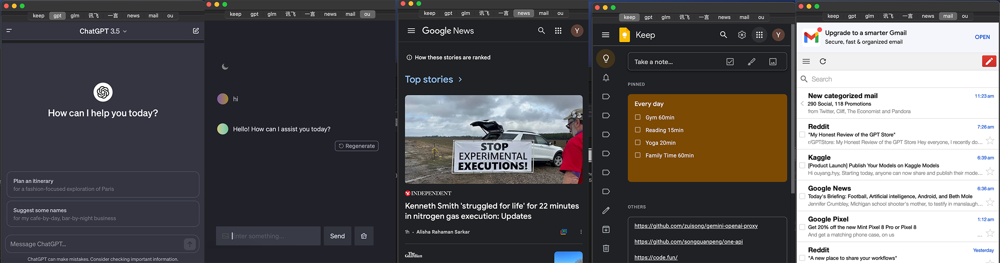

# MinBrowser

## Content

This is a mini browser that opens multiple windows, fixed to the right side of the screen. You can customize your own page and use it as an app. With this app, you can install several other apps less. 

This app is like an assistant who is always waiting there so quietly that you don't even feel his presence.When you are in need, he will respond quickly to your common needs.

And shockingly, the size of this app is just less than 2m, open 10 websites, occupy less than 200m of memory, far less than the memory consumption of other browsers or software.




## Usage

1. The config file is ~/.MinBrowser.json, the file is in you home directory. You can modify it with a backup. Copy to your home dirctory.

2. It works with another app. For example,  start a LLM background service locally, then add a window in this app, to realize anytime anywhere access to chatgpt-like services.
I write this program to start a service in background.

https://github.com/zazaji/StatusBarRunner

and I use this repo to build a chat service,based on google gemini api.

https://github.com/babaohuang/GeminiProChat


3. I don't have an apple developer ID  and this app is not signed, you can use the following terminal commands to be able to use this app.

```bash
sudo spctl --master-disable
sudo xattr -r -d com.apple.quarantine /Applications/MinBrowser.app
```


